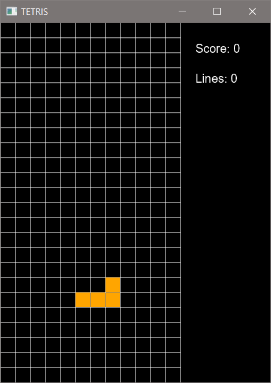

# Tetris

## Implementation

This tetris game is written in JavaFX. I got some online help from @Gaspared.

## Getting Started
To run this code you need to run it with:
- [JDK 1.8](https://www.oracle.com/ca-en/java/technologies/javase/javase8-archive-downloads.html) 
- JDK 1.8 comes with JavaFX
- [JDK 1.8 / JavaFX Documentation](https://www.oracle.com/java/technologies/javase-jdk8-doc-downloads.html)
- To run and play the simulation run Tetris.java in the app/ folder

 

